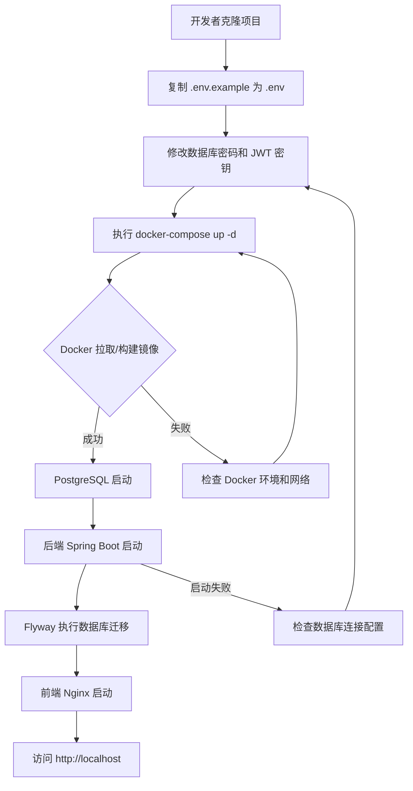

## 修订历史

| 版本 | 日期 | 修订人 | 修订内容 |
|------|------|--------|----------|
| 1.0 | 2026-06-16 | AI | 首版创建：Docker 部署模块完整需求定义 |

---

## 1. 用户故事

| 编号 | 角色 | 我想要... | 以便于... | 优先级 | 验收标准 |
|------|------|-----------|-----------|--------|----------|
| US-DEPLOY-001 | 后端开发者 | 通过一条命令启动整套环境 | 本地快速搭建 DevPilot 进行开发调试 | P0 | `docker-compose up -d` 后所有服务正常运行 |
| US-DEPLOY-002 | 运维人员 | 查看清晰的部署说明 | 了解如何配置和启动服务 | P1 | README 中包含完整的启动步骤和环境要求 |
| US-DEPLOY-003 | 后端开发者 | 数据库自动初始化 | 首次启动时自动建表 | P1 | 后端启动时执行 Flyway 或 SQL 初始化脚本 |

## 2. 部署架构

```
┌─────────────────────────────────────────────────┐
│                 Docker Compose                   │
│                                                  │
│  ┌──────────┐  ┌──────────┐  ┌───────────────┐ │
│  │  Nginx   │  │  Backend │  │  PostgreSQL   │ │
│  │  (前端)  │  │  :8080   │  │  :5432        │ │
│  │  :80     │  │          │  │               │ │
│  └────┬─────┘  └────┬─────┘  └───────┬───────┘ │
│       │              │               │          │
│       │  静态资源     │   JDBC       │          │
│       │<─────────────│──────────────>│          │
│       │              │               │          │
│       │  API 代理 /api → backend:8080│          │
│       │<─────────────────────────────│          │
└─────────────────────────────────────────────────┘
```

## 3. 产出物清单

| 文件 | 说明 |
|------|------|
| `backend/Dockerfile` | 后端 Spring Boot 镜像构建文件 |
| `frontend/Dockerfile` | 前端 Vue 3 静态资源构建 + Nginx 镜像 |
| `docker-compose.yml` | 编排文件，定义 backend、frontend、database 三个服务 |
| `.env` / `.env.example` | 环境变量配置文件模板 |
| `README.md` | 项目启动说明 |

## 4. 配置要点

### 4.1 Docker Compose 服务定义

| 服务 | 镜像 | 端口映射 | 依赖 | 环境变量 |
|------|------|----------|------|----------|
| database | postgres:16-alpine | 内部网络 | - | POSTGRES_DB, POSTGRES_USER, POSTGRES_PASSWORD |
| backend | 本地构建 | 127.0.0.1:8080:8080 | database | DB_HOST, DB_PORT, DB_NAME, DB_USER, DB_PASSWORD, JWT_SECRET |
| frontend | 本地构建 (Nginx) | 80:80 | backend | VITE_API_BASE_URL |

### 4.2 环境变量设计

```env
# 数据库
DB_HOST=database
DB_PORT=5432
DB_NAME=devpilot
DB_USER=devpilot
DB_PASSWORD=CHANGE_ME_STRONG_DATABASE_PASSWORD

# JWT
JWT_SECRET=CHANGE_ME_AT_LEAST_32_RANDOM_CHARS

# 前端 API 地址
VITE_API_BASE_URL=http://localhost:8080
```

### 4.3 后端 Dockerfile 要点

- 基础镜像：`eclipse-temurin:17-jre-alpine`
- 多阶段构建：先 Maven/Gradle 构建 JAR，再复制到运行时镜像
- 启动命令：`java -jar app.jar`
- 健康检查：`curl -f http://localhost:8080/actuator/health`

### 4.4 前端 Dockerfile 要点

- 多阶段构建：
  - 阶段1：`node:20-alpine`，执行 `npm install && npm run build`
  - 阶段2：`nginx:alpine`，复制 dist 到 `/usr/share/nginx/html`
- Nginx 配置：`/api` 代理到 `backend:8080`
- 健康检查：`curl -f http://localhost:80/`

### 4.5 README 结构

```markdown
# DevPilot - 工程问题排查助手

## 环境要求
- Docker 20.10+
- Docker Compose 2.0+

## 快速启动
1. 克隆项目
2. 复制 .env.example 为 .env，修改密码等配置
3. 执行 docker-compose up -d
4. 访问 http://localhost

## 演示账号
- 只读访客：demo / DevPilotDemo2026!
- 管理员密码只在服务器 .env 中配置，不写入公开文档。

## 技术栈
- 后端：Java 17 + Spring Boot 3
- 前端：Vue 3 + TypeScript + Element Plus
- 数据库：PostgreSQL 16
```

## 5. 业务流程图 (Mermaid)



## 6. 异常与边界

| 异常类型 | 触发条件 | 用户提示/日志 | 处理方式 |
|----------|----------|---------------|----------|
| 端口冲突 | 80/8080/5432 被占用 | 启动报错 | 修改 docker-compose.yml 端口映射 |
| 数据库连接失败 | DB_HOST 配置错误 | 后端日志报连接超时 | 检查 .env 中 DB_HOST 是否为 database（容器名） |
| 镜像构建失败 | 网络问题或 Dockerfile 错误 | 构建报错 | 检查 Dockerfile 和网络连接 |
| 数据库未初始化 | 首次启动 | 后端自动执行迁移 | Flyway 自动建表，无需手动操作 |
| 前端 404 | Nginx 配置错误 | 页面白屏 | 检查前端路由模式和 Nginx try_files 配置 |
