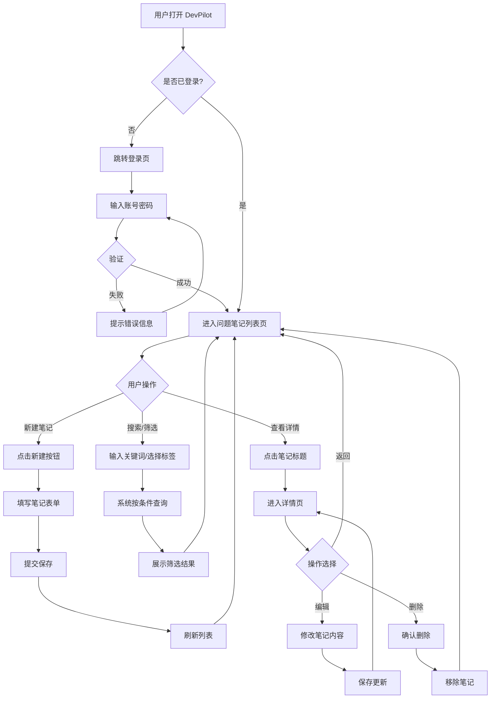
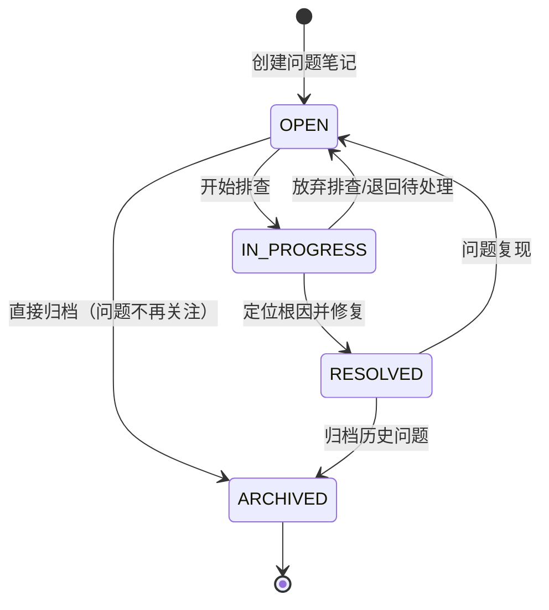
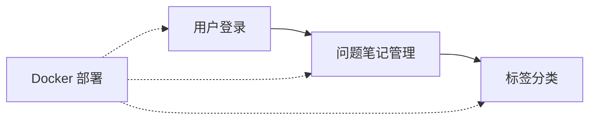

## 0. 文档元数据

| 属性 | 值 |
|------|-----|
| 产品名称 | DevPilot |
| 需求池 | V1.0 基础版 |
| 生成日期 | 2026-06-16 |

## 1. 背景与目标

### 1.1 业务背景

Java 后端开发者在日常工作中频繁遇到线上问题排查场景：
- 同样的问题反复出现，排查经验散落在个人笔记、聊天记录或脑海中，无法沉淀和复用
- 排查命令（如 jstack、jmap、kubectl、数据库查询等）每次都要重新回忆参数和语法
- 日志分析缺乏结构化工具，需要手动在多个日志文件间跳转比对
- 团队成员的经验无法共享，新成员上手排查效率低

DevPilot 定位为**面向后端开发者的工程问题排查助手**，核心价值是将零散的排查经验结构化沉淀，提供快速检索和复用能力。

### 1.2 核心目标

| 目标 | 衡量指标 |
|------|----------|
| 问题知识沉淀 | 支持创建、编辑、归档问题笔记，形成团队知识库 |
| 快速检索 | 支持标签分类+关键词搜索，3秒内定位目标笔记 |
| 团队共享 | 登录后团队成员可查看共享的问题库 |
| 一键部署 | Docker Compose 一键启动全栈环境 |

### 1.3 功能范围（V1.0）

| 功能模块 | 说明 | 优先级 |
|----------|------|--------|
| 用户登录 | 账号密码登录，Session/Token 鉴权 | P0 |
| 问题笔记管理 | 新增、编辑、删除、查看问题笔记 | P0 |
| 标签分类 | 为笔记打标签，支持按标签筛选 | P0 |
| 关键词搜索 | 按标题、内容关键字搜索笔记 | P0 |
| 问题详情页 | 笔记的完整展示页 | P0 |
| Docker 部署 | Dockerfile + docker-compose 本地部署 | P1 |

## 2. 目标用户与角色权限矩阵

### 2.1 用户角色定义

| 角色名称 | 职责描述 | 可操作范围 |
|----------|----------|------------|
| 管理员 | 系统全局管理 | 管理所有笔记、标签、用户；系统配置 |
| 后端开发者 | 问题笔记的主要贡献者和消费者 | 创建/编辑/删除自己的笔记；查看所有共享笔记；管理标签 |
| 查看者 | 测试/运维人员，只读访问 | 查看所有共享笔记；按标签和关键词搜索 |

### 2.2 数据权限规则

| 资源 | 管理员 | 后端开发者 | 查看者 |
|------|--------|------------|--------|
| 自己的笔记 | 全部操作 | 全部操作 | 不可创建 |
| 他人的笔记 | 全部操作 | 只读 | 只读 |
| 标签管理 | 全部操作 | 全部操作 | 只读 |
| 用户管理 | 全部操作 | 无 | 无 |

## 3. 全局枚举定义

### 3.1 问题状态枚举

| 枚举值 | 说明 | 使用场景 |
|--------|------|----------|
| `OPEN` | 待解决 | 新创建或已复现但未定位根因 |
| `IN_PROGRESS` | 排查中 | 正在分析、定位根因 |
| `RESOLVED` | 已解决 | 根因已定位并修复 |
| `ARCHIVED` | 已归档 | 历史问题，不再活跃关注 |

### 3.2 优先级枚举

| 枚举值 | 说明 | 颜色标记 |
|--------|------|----------|
| `P0` | 紧急 | 红色，影响线上服务 |
| `P1` | 高 | 橙色，重要问题 |
| `P2` | 中 | 蓝色，一般问题 |
| `P3` | 低 | 灰色，优化类/经验记录 |

### 3.3 问题分类枚举

| 枚举值 | 说明 |
|--------|------|
| `PERFORMANCE` | 性能问题 |
| `EXCEPTION` | 异常/报错 |
| `CONFIG` | 配置问题 |
| `ENVIRONMENT` | 环境问题 |
| `BUSINESS_LOGIC` | 业务逻辑 |
| `OTHER` | 其他 |

## 4. 整体业务流程

### 4.1 业务流程图 (Mermaid)

### 4.2 业务逻辑说明

| 步骤 | 说明 |
|------|------|
| Step 1 | 用户访问系统，系统检查登录状态；未登录则跳转登录页 |
| Step 2 | 登录成功后进入问题笔记列表页，默认展示所有笔记，支持分页 |
| Step 3 | 用户可通过关键词搜索（模糊匹配标题和内容）和标签筛选缩小范围 |
| Step 4 | 用户点击"新建"按钮，填写标题、内容、分类、优先级、标签后提交 |
| Step 5 | 用户点击笔记标题进入详情页，查看完整信息（问题描述、解决方案、标签、状态等） |
| Step 6 | 在详情页可编辑笔记内容或删除笔记；编辑/删除需校验权限（仅本人或管理员） |

## 5. 状态机与流转矩阵

### 5.1 状态流转图 (Mermaid)

### 5.2 状态流转矩阵

| 当前状态 | 触发操作 | 目标状态 | 执行角色 | 前置条件 | 备注 |
|----------|----------|----------|----------|----------|------|
| - | 创建笔记 | `OPEN` | 后端开发者/管理员 | 标题必填 | 新建时默认状态 |
| `OPEN` | 开始排查 | `IN_PROGRESS` | 后端开发者/管理员 | 笔记归属人或管理员 | 标记正在处理 |
| `OPEN` | 直接归档 | `ARCHIVED` | 后端开发者/管理员 | 笔记归属人或管理员 | 问题不再关注 |
| `IN_PROGRESS` | 修复完成 | `RESOLVED` | 后端开发者/管理员 | 已填写解决方案 | 根因已定位 |
| `IN_PROGRESS` | 退回 | `OPEN` | 后端开发者/管理员 | 笔记归属人或管理员 | 放弃当前排查 |
| `RESOLVED` | 问题复现 | `OPEN` | 后端开发者/管理员 | 笔记归属人或管理员 | 同类问题再次出现 |
| `RESOLVED` | 归档 | `ARCHIVED` | 后端开发者/管理员 | 笔记归属人或管理员 | 长期不再关注 |
| `ARCHIVED` | - | - | - | - | 终态，不可操作 |

## 6. 功能模块

| 序号 | 模块名称 | 文件路径 | 状态 | 说明 |
|------|----------|----------|------|------|
| 1 | 用户登录 | `用户登录/用户登录.md` | 待生成 | 账号密码登录、会话管理 |
| 2 | 问题笔记管理 | `问题笔记管理/问题笔记管理.md` | 待生成 | 笔记CRUD、列表、详情、搜索 |
| 3 | 标签分类 | `标签分类/标签分类.md` | 待生成 | 标签管理、笔记关联、标签筛选 |
| 4 | Docker 部署 | `Docker 部署/Docker 部署.md` | 待生成 | Dockerfile、docker-compose、README |

**模块依赖关系：**

