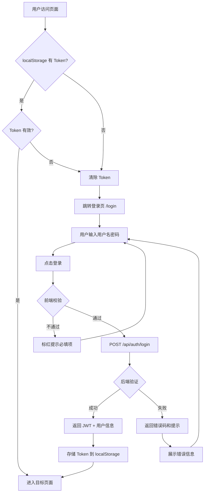

## 1. 用户故事

| 编号 | 角色 | 我想要... | 以便于... | 优先级 | 验收标准 |
|------|------|-----------|-----------|--------|----------|
| US-LOGIN-001 | 所有用户 | 使用账号密码登录系统 | 访问问题笔记库 | P0 | 输入正确凭据后跳转到笔记列表页 |
| US-LOGIN-002 | 所有用户 | 看到登录失败的具体提示 | 知道是账号还是密码错了 | P1 | 失败时区分"用户不存在"和"密码错误" |
| US-LOGIN-003 | 所有用户 | 登录成功后保持会话 | 刷新页面不需要重新登录 | P0 | Token 有效期内刷新页面保持登录态 |
| US-LOGIN-004 | 所有用户 | 退出登录 | 安全离开系统 | P1 | 点击退出后清除 Token 并跳转登录页 |

## 2. 页面模块图

```
┌──────────────────────────────────────────────────┐
│                    DevPilot Logo                   │
│              工程问题排查助手                       │
│                                                    │
│  ┌──────────────────────────────────────────────┐ │
│  │                                              │ │
│  │  用户名  [___________________]               │ │
│  │                                              │ │
│  │  密码    [___________________]  👁           │ │
│  │                                              │ │
│  │  [          登  录          ]                │ │
│  │                                              │ │
│  └──────────────────────────────────────────────┘ │
│                                                    │
│            v1.0.0  ·  Powered by DevPilot         │
└──────────────────────────────────────────────────┘
```

## 3. 数据字段

- **用户名**（必填，3~50字符，字母/数字/下划线）
- **密码**（必填，6~100字符，支持密码显隐切换）

## 4. 前端交互

### 4.1 登录表单

| 表单项 | 组件类型 | 必填 | 校验规则 | 说明 |
|--------|----------|------|----------|------|
| 用户名 | 文本输入框 | 是 | 非空，长度3-50 | 前端+后端双重校验 |
| 密码 | 密码输入框 | 是 | 非空，长度6-100 | 支持点击眼睛图标切换显隐 |

### 4.2 操作按钮

| 按钮名称 | 位置 | 权限要求 | 交互说明 |
|----------|------|----------|----------|
| 登录 | 表单底部 | 无 | 校验通过后调用 `/api/auth/login`，成功跳转 `/notes`，失败提示错误信息 |

### 4.3 登录成功后

| 行为 | 说明 |
|------|------|
| Token 存储 | JWT Token 存入 localStorage，后续请求通过 `Authorization: Bearer <token>` 携带 |
| 跳转 | 跳转到问题笔记列表页 `/notes` |
| Token 过期 | 后端返回 401 时前端自动跳转登录页 |

### 4.4 空状态/缺省页

无此场景（登录页表单固定展示）。

## 5. 业务流程（文字版）

- Step 1：用户访问任意页面，路由守卫检查 localStorage 中是否存在有效 Token
- Step 2：无 Token 或 Token 已过期 → 跳转登录页 `/login`
- Step 3：用户输入用户名和密码，点击"登录"
- Step 4：前端校验非空后，POST `/api/auth/login` 发送凭据
- Step 5：后端验证 → 成功返回 JWT Token + 用户信息；失败返回错误码和提示
- Step 6：前端存储 Token，跳转至目标页面（或默认 `/notes`）

## 6. 业务流程图 (Mermaid)



## 7. 异常与边界

| 异常类型 | 触发条件 | 用户提示 | 系统处理 | 恢复方式 |
|----------|----------|----------|----------|----------|
| 账号不存在 | 用户名未注册 | "用户名或密码错误" | 返回 401 | 检查用户名拼写 |
| 密码错误 | 密码不匹配 | "用户名或密码错误" | 返回 401 | 重新输入或重置密码 |
| Token 过期 | JWT 超过有效期 | 自动跳转登录页 | 拦截器返回 401 | 重新登录 |
| 重复登录 | 已登录状态再次访问 /login | 自动跳转 /notes | 路由守卫检测 | 无需操作 |
