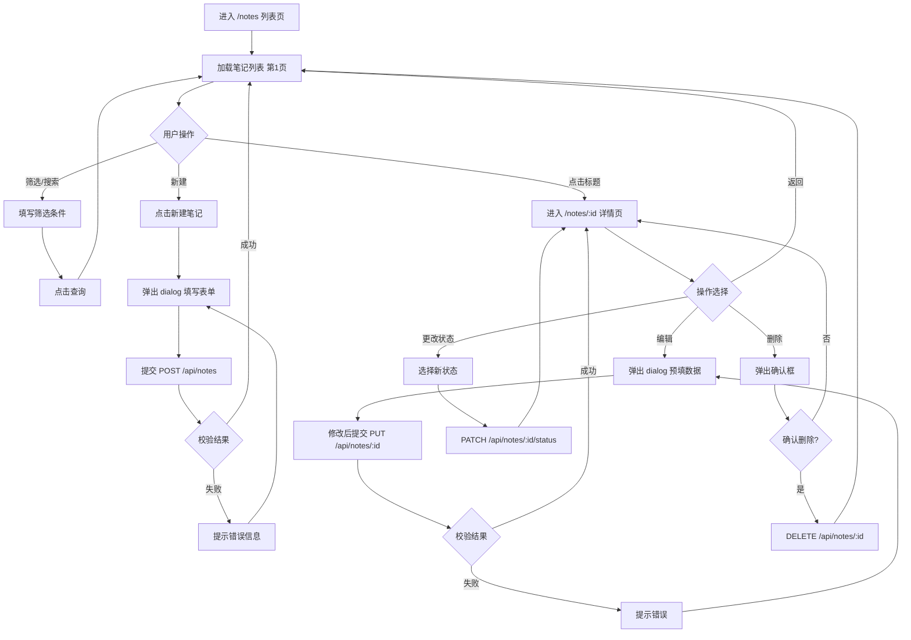

## 修订历史

| 版本 | 日期 | 修订人 | 修订内容 |
|------|------|--------|----------|
| 1.0 | 2026-06-16 | AI | 首版创建：问题笔记管理模块完整需求定义 |

---

## 1. 用户故事

| 编号 | 角色 | 我想要... | 以便于... | 优先级 | 验收标准 |
|------|------|-----------|-----------|--------|----------|
| US-NOTE-001 | 后端开发者 | 创建一条问题笔记 | 记录排查过程和解决方案 | P0 | 填写必填字段后点击保存，列表中可见新笔记 |
| US-NOTE-002 | 所有用户 | 浏览问题笔记列表并分页 | 快速找到需要的问题 | P0 | 列表默认分页展示，每页20条，支持页码跳转 |
| US-NOTE-003 | 所有用户 | 通过关键词搜索笔记 | 快速定位相关问题的笔记 | P0 | 输入关键词后列表实时过滤匹配标题/内容的笔记 |
| US-NOTE-004 | 所有用户 | 按标签筛选笔记 | 查看某一类问题的所有笔记 | P0 | 选择标签后列表仅展示关联该标签的笔记 |
| US-NOTE-005 | 所有用户 | 查看笔记完整详情 | 了解问题背景、排查过程、解决方案 | P0 | 点击笔记标题跳转详情页，展示全部字段 |
| US-NOTE-006 | 后端开发者 | 编辑我创建的笔记 | 补充排查进展或修正信息 | P0 | 仅本人或管理员可见编辑按钮，修改后保存生效 |
| US-NOTE-007 | 后端开发者 | 删除不再需要的笔记 | 清理无效内容 | P1 | 点击删除后弹出确认框，确认后移除笔记 |
| US-NOTE-008 | 后端开发者 | 更改笔记状态 | 跟踪排查进度 | P1 | 通过下拉或按钮切换状态（待解决→排查中→已解决→已归档） |
| US-NOTE-009 | 所有用户 | 按状态/优先级/分类筛选 | 快速找到特定类型的问题 | P1 | 选择筛选条件后列表刷新 |

## 2. 页面模块图

**列表页：**

```
┌──────────────────────────────────────────────────────────┐
│  DevPilot                            [用户名] [退出]     │
├──────────┬───────────────────────────────────────────────┤
│          │  🏷 问题笔记管理                               │
│  问题笔记 │ ┌───────────────────────────────────────────┐ │
│  标签管理 │ │ [🔍 关键词搜索...]  [标签筛选▾] [状态▾] [优先级▾] [分类▾] [查询] │ │
│          │ └───────────────────────────────────────────┘ │
│          │ ┌───────────────────────────────────────────┐ │
│          │ │ [+ 新建笔记]                              │ │
│          │ ├───┬────────┬──────┬──────┬──────┬────────┤ │
│          │ │ # │ 标题   │ 状态 │ 优先级│ 分类 │ 更新时间│ │
│          │ ├───┼────────┼──────┼──────┼──────┼────────┤ │
│          │ │ 1 │ OOM排查│ 已解决│ P0   │ 性能  │ 06-15  │ │
│          │ │ 2 │ 连接超时│排查中│ P1   │ 配置  │ 06-14  │ │
│          │ │ 3 │ NPE分析│ 待解决│ P2   │ 异常  │ 06-13  │ │
│          │ ├───┴────────┴──────┴──────┴──────┴────────┤ │
│          │ │       < 1  2  3 ... 10 >  共200条        │ │
│          │ └───────────────────────────────────────────┘ │
└──────────┴───────────────────────────────────────────────┘
```

**详情页：**

```
┌──────────────────────────────────────────────────────────┐
│  DevPilot                            [用户名] [退出]     │
├──────────┬───────────────────────────────────────────────┤
│          │  ← 返回列表                                   │
│  问题笔记 │ ┌───────────────────────────────────────────┐ │
│  标签管理 │ │                                            │ │
│          │ │  标题：线上服务 OOM 问题排查与解决           │ │
│          │ │                                            │ │
│          │ │  状态：已解决    优先级：P0    分类：性能    │ │
│          │ │  标签：[JVM] [OOM] [内存泄漏]               │ │
│          │ │  创建者：张三    创建时间：2026-06-10       │ │
│          │ │  更新时间：2026-06-15                       │ │
│          │ │                                            │ │
│          │ │  问题描述：                                 │ │
│          │ │  服务运行 3 天后频繁 Full GC...             │ │
│          │ │                                            │ │
│          │ │  排查过程：                                 │ │
│          │ │  1. jmap -histo 查看对象分布...             │ │
│          │ │                                            │ │
│          │ │  解决方案：                                 │ │
│          │ │  修复 ThreadLocal 未 remove 的问题...        │ │
│          │ │                                            │ │
│          │ │  [编辑]  [删除]  [更改状态▾]               │ │
│          │ └───────────────────────────────────────────┘ │
└──────────┴───────────────────────────────────────────────┘
```

## 3. 数据字段

- **标题**（必填，1~200字符）
- **问题描述**（必填，文本域，建议≤10000字符）
- **排查过程**（选填，文本域）
- **解决方案**（选填，文本域；状态为 RESOLVED 时建议填写）
- **状态**（必填，枚举：OPEN/IN_PROGRESS/RESOLVED/ARCHIVED，默认 OPEN）
- **优先级**（必填，枚举：P0/P1/P2/P3，默认 P2）
- **分类**（必填，枚举：PERFORMANCE/EXCEPTION/CONFIG/ENVIRONMENT/BUSINESS_LOGIC/OTHER，默认 OTHER）
- **标签**（选填，多对多关联 tag 表）
- **创建者ID**（系统自动填充）
- **创建时间**（系统自动填充）
- **更新时间**（系统自动维护）

## 4. 前端交互

### 4.1 筛选栏

| 筛选项 | 组件类型 | 必填 | 校验规则 | 查询方式 | 说明 |
|--------|----------|------|----------|----------|------|
| 关键词 | 文本输入框 | 否 | 无 | 模糊（标题+内容） | 支持回车触发搜索 |
| 标签 | 多选下拉 | 否 | 无 | 精确（标签ID） | 从标签表动态加载 |
| 状态 | 下拉单选 | 否 | 无 | 精确 | OPEN/IN_PROGRESS/RESOLVED/ARCHIVED |
| 优先级 | 下拉单选 | 否 | 无 | 精确 | P0/P1/P2/P3 |
| 分类 | 下拉单选 | 否 | 无 | 精确 | 六种分类 |
| 查询 | 按钮 | - | - | - | 触发联合查询 |

### 4.2 操作栏

| 按钮名称 | 位置 | 权限要求 | 显示条件 | 交互载体 | 交互说明 |
|----------|------|----------|----------|----------|----------|
| 新建笔记 | 列表顶部 | 后端开发者/管理员 | 始终显示 | dialog 弹窗 | 打开 800px 宽弹窗，填写表单后提交 |
| 编辑 | 详情页底部 | 笔记创建者/管理员 | 非查看者 | dialog 弹窗 | 打开同新建表单的弹窗，预填现有数据 |
| 删除 | 详情页底部 | 笔记创建者/管理员 | 非查看者 | 确认弹窗 | 弹出二次确认：确定删除后调用 DELETE 接口 |
| 更改状态 | 详情页底部 | 后端开发者/管理员 | 非查看者 | 下拉选择 | 直接选择目标状态，实时调用接口更新 |

### 4.3 表格展示（列表页）

| 列名 | 数据类型 | 展示规则 | 数据处理 |
|------|----------|----------|----------|
| 序号 | 数字 | 自增序号 | 基于分页计算（(page-1)*size + index） |
| 标题 | 文本 | 可点击链接 | 点击跳转详情页；过长截断+省略号 |
| 状态 | 枚举 | 彩色标签 Tag | OPEN=蓝, IN_PROGRESS=橙, RESOLVED=绿, ARCHIVED=灰 |
| 优先级 | 枚举 | 彩色标签 Tag | P0=红, P1=橙, P2=蓝, P3=灰 |
| 分类 | 枚举 | 文本 | 中文展示：性能问题/异常报错/配置问题等 |
| 标签 | 标签数组 | Tag 列表 | 最多展示3个，超出显示"+N" |
| 更新时间 | 时间戳 | 格式化展示 | yyyy-MM-dd HH:mm |

### 4.4 弹窗/页面交互

| 交互名称 | 触发条件 | 交互载体 | 容器规格 | 表单项 | 提交行为 |
|----------|----------|----------|----------|--------|----------|
| 新建笔记 | 点击"新建笔记" | dialog | 800px 宽 | 标题、问题描述、分类、优先级、标签、状态 | POST /api/notes，成功后关闭弹窗并刷新列表 |
| 编辑笔记 | 详情页点击"编辑" | dialog | 800px 宽（同新建） | 同上，预填现有数据 | PUT /api/notes/:id，成功后关闭弹窗并刷新详情 |
| 删除确认 | 详情页点击"删除" | dialog 确认框 | 420px 宽 | 提示文案："确定删除该笔记？此操作不可撤销" | DELETE /api/notes/:id，成功后跳转回列表 |
| 笔记详情 | 列表页点击标题 | 独立页面 | 路由 /notes/:id | 完整字段展示 + 操作按钮 | - |

### 4.5 空状态/缺省页

- 无数据时：展示空状态插图 + "暂无问题笔记，点击上方按钮创建第一条"
- 搜索无结果时：展示 "未找到匹配的问题笔记，请调整筛选条件"

## 5. 业务流程（文字版）

- Step 1：用户进入 `/notes`，系统默认加载第一页笔记列表（每页20条，按更新时间倒序）
- Step 2：用户可通过筛选栏组合条件：关键词模糊匹配标题/内容 + 标签精确筛选 + 状态/优先级/分类下拉筛选
- Step 3：点击"查询"或回车触发带条件分页查询，刷新列表
- Step 4：点击"新建笔记"，弹出 dialog，填写标题（必填）、问题描述（必填）、分类、优先级、标签后提交
- Step 5：点击列表中的标题进入 `/notes/:id` 详情页，查看完整内容
- Step 6：在详情页可点击编辑（弹出预填 dialog）、删除（二次确认）、更改状态（下拉直接切换）
- Step 7：所有写操作（新建/编辑/删除/改状态）成功后自动刷新相关视图

## 6. 业务流程图 (Mermaid)



## 7. 状态流转表

| 当前状态 | 触发事件/动作 | 前置条件 | 系统处理 | 下一状态 | 失败/异常分支 | 备注 |
|----------|--------------|----------|----------|----------|--------------|------|
| - | 创建笔记 | 标题、问题描述必填 | 插入 issue_note 记录，默认 OPEN | OPEN | 必填字段为空 → 返回校验错误 | 创建者自动设为当前用户 |
| OPEN | 开始排查 | 笔记归属人或管理员 | 更新状态字段 | IN_PROGRESS | 权限不足 → 返回 403 | - |
| OPEN | 直接归档 | 笔记归属人或管理员 | 更新状态字段 | ARCHIVED | 权限不足 → 返回 403 | 问题不再关注 |
| IN_PROGRESS | 修复完成 | 笔记归属人或管理员 | 更新状态 + 建议填写解决方案 | RESOLVED | 权限不足 → 返回 403 | 可同时更新解决方案 |
| IN_PROGRESS | 退回 | 笔记归属人或管理员 | 更新状态字段 | OPEN | 权限不足 → 返回 403 | 放弃当前排查 |
| RESOLVED | 问题复现 | 笔记归属人或管理员 | 更新状态字段 | OPEN | 权限不足 → 返回 403 | 同类问题再次出现 |
| RESOLVED | 归档 | 笔记归属人或管理员 | 更新状态字段 | ARCHIVED | 权限不足 → 返回 403 | - |
| ARCHIVED | - | - | - | - | - | 终态，不可操作 |

## 8. 异常与边界

| 异常类型 | 触发条件 | 用户提示 | 系统处理 | 恢复方式 |
|----------|----------|----------|----------|----------|
| 标题为空 | 新建/编辑时标题未填 | "标题不能为空" | 前端校验拦截 | 填写标题后重试 |
| 权限不足 | 非创建者/管理员编辑他人笔记 | "无权操作该笔记" | 返回 403 | - |
| 笔记不存在 | 访问已删除的笔记ID | "笔记不存在或已被删除" | 返回 404，前端跳转列表 | - |
| 并发编辑 | 两人同时编辑同一条笔记 | 后提交者可能覆盖 | V1.0 不处理（最后写入胜出） | 后续版本可加乐观锁 |
| 分页越界 | 请求超出总页数的页码 | 返回空列表 | 后端返回空数据 | 前端重置到第一页 |
